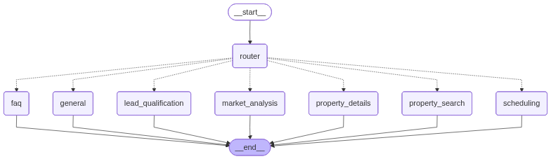

# PropertyAI

A sophisticated multi-agent real estate AI system built with Pydantic AI and LangGraph, designed to handle various real estate tasks through WhatsApp, Telegram, and other messaging platforms.

## Architecture

This system uses a **multi-agent architecture** with specialized agents coordinated by LangGraph:



The graph visualization above shows the complete flow of messages through the system. All messages start at `__start__`, are routed by the `router` agent to the appropriate specialist, and end at `__end__`.

### Complete System Architecture

For detailed architecture diagrams showing all components, integrations, and data flows:

- **[architecture_diagram.md](architecture_diagram.md)**: Complete Mermaid diagram with all components and connections
- **[architecture_simple.md](architecture_simple.md)**: Simplified guide optimized for importing into Miro or Draw.io

The Mermaid diagram can be:
- Rendered directly in GitHub (supports Mermaid)
- Exported to PNG/SVG using Mermaid Live Editor
- Imported into Miro or Draw.io for further customization

The system architecture includes:

- **🌐 External Integrations**: WhatsApp, Telegram, and extensible platforms
- **🚀 FastAPI Server**: Webhook endpoints and route handlers
- **🎯 LangGraph Orchestration**: State management and intelligent routing
- **🤖 Pydantic AI Agents**: 8 specialized agents with distinct roles
- **🛠️ Tools & Functions**: Property, scheduling, and market analysis tools
- **💾 Memory & Storage**: Supabase PostgreSQL for long-term memory
- **📚 Knowledge Base**: Milvus/Supabase PGVector for RAG capabilities
- **🧠 LLM Services**: OpenAI GPT-4o-mini with embedding support
- **📊 Monitoring**: Logfire and OpenTelemetry for observability

### Specialized Agents

1. **Router Agent** - Analyzes incoming messages and routes them to the appropriate specialist
2. **Lead Qualification Agent** - Qualifies new leads and gathers client requirements
3. **Property Search Agent** - Searches and filters properties based on criteria
4. **Property Details Agent** - Provides detailed information about specific properties
5. **Scheduling Agent** - Handles viewing appointments and scheduling
6. **Market Analysis Agent** - Provides market trends and financial calculations
7. **FAQ Agent** - Answers general questions about the real estate process
8. **General Agent** - Handles greetings and general conversation

### Tools

The system includes comprehensive real estate tools:

- **Property Tools** (`tools/property_tools.py`):
  - `search_properties` - Search properties by various criteria
  - `get_property_details` - Get detailed property information
  - `estimate_property_value` - Estimate market value
  - `get_similar_properties` - Find similar properties

- **Scheduling Tools** (`tools/scheduling_tools.py`):
  - `schedule_viewing` - Schedule property viewings
  - `get_available_slots` - Check available time slots
  - `cancel_appointment` - Cancel appointments
  - `get_client_appointments` - View client's appointments

- **Market Tools** (`tools/market_tools.py`):
  - `calculate_mortgage` - Calculate mortgage payments
  - `get_market_trends` - Get market statistics and trends
  - `compare_properties` - Compare multiple properties

## Setup

1. Install dependencies:
```bash
uv sync
```

2. Create a `.env` file with:
```
OPENAI_API_KEY=your_openai_api_key
WHATSAPP_API_TOKEN=your_whatsapp_token
WHATSAPP_PHONE_NUMBER_ID=your_phone_number_id
WHATSAPP_VERIFY_TOKEN=your_verify_token
AGENT_NAME=Your Agent Name
COMPANY_NAME=Your Company Name
LOGFIRE_TOKEN=your_logfire_token (optional)
```

3. Run the server:
```bash
python main.py
```

Or use uvicorn directly:
```bash
uvicorn api.app:app --reload --host 0.0.0.0 --port 8000
```

## How It Works

1. **Message Reception**: WhatsApp messages are received via webhook (`/whatsapp/webhook`)
2. **Routing**: The router agent analyzes the message and determines which specialist should handle it
3. **Specialized Processing**: The appropriate agent processes the request using relevant tools
4. **Response**: The agent's response is sent back via WhatsApp

### Message Flow

```
START
  │
  ▼
ROUTER ──┐
         │
         ├──► lead_qualification ──► END
         ├──► property_search ──► END
         ├──► property_details ──► END
         ├──► scheduling ──► END
         ├──► market_analysis ──► END
         ├──► faq ──► END
         └──► general ──► END
```

The router uses conditional routing (dotted lines in the graph) to intelligently direct messages to the most appropriate agent based on the user's intent.

## Flow Example

```
User: "I'm looking for a 3 bedroom apartment downtown"
  ↓
Router Agent: Routes to "property_search"
  ↓
Property Search Agent: Uses search_properties tool
  ↓
Response: Shows matching properties
```

## Features

- ✅ **Multi-agent architecture** with 8 specialized agents
- ✅ **LangGraph orchestration** for intelligent routing and flow control
- ✅ **Comprehensive real estate tools** (property search, scheduling, market analysis)
- ✅ **Error handling and retry logic** with exponential backoff
- ✅ **Conversation history management** (maintains context across messages)
- ✅ **WhatsApp integration** via Meta Cloud API
- ✅ **Base prompt system** ensuring all agents have company information
- ✅ **Property search and filtering** with multiple criteria
- ✅ **Appointment scheduling** with availability checking
- ✅ **Market analysis** including mortgage calculations and trends
- ✅ **Graph visualization** tools for understanding the system flow

## Project Structure

```
whatsapp/
├── agent.py                 # Main orchestration with LangGraph
├── main.py                  # Entry point and graph execution
├── visualize_graph.ipynb    # Jupyter notebook for graph visualization
├── graph_flow.png           # Graph visualization image
├── agents/                  # Specialized agents
│   ├── base_agent.py       # Base configuration and shared prompts
│   ├── router_agent.py     # Intelligent message routing
│   ├── lead_qualification_agent.py
│   ├── property_search_agent.py
│   ├── property_details_agent.py
│   ├── scheduling_agent.py
│   ├── market_analysis_agent.py
│   ├── faq_agent.py
│   └── general_agent.py
├── tools/                   # Real estate tools
│   ├── property_tools.py
│   ├── scheduling_tools.py
│   └── market_tools.py
└── api/                     # FastAPI application
    ├── app.py
    └── routes/
        └── whatsapp.py
```

## Visualization

To visualize and explore the graph structure, use the included Jupyter notebook:

```bash
jupyter notebook visualize_graph.ipynb
```

The notebook includes:
- Interactive graph visualization
- Node and edge information
- Agent tools overview
- Test message examples
- Export capabilities (Mermaid diagram and PNG)

## Customization

### Adding New Agents

1. Create a new agent file in `agents/`
2. Import and add it to `agent.py`
3. Add routing logic in `router_agent.py`
4. Add a node in the LangGraph workflow

### Adding New Tools

1. Add tool functions to the appropriate `tools/` file
2. Register tools with agents using `@agent.tool_plain()`

### Modifying Routing Logic

Edit the `router_agent.py` system prompt to change how messages are routed.

## Agent Capabilities

Each agent has access to specific tools and is optimized for its role:

| Agent | Tools | Purpose |
|-------|-------|---------|
| Router | None | Analyzes and routes messages |
| Lead Qualification | `search_properties` | Qualifies leads and gathers requirements |
| Property Search | `search_properties`, `get_property_details`, `get_similar_properties` | Finds and presents properties |
| Property Details | `get_property_details`, `estimate_property_value`, `get_similar_properties` | Provides detailed property info |
| Scheduling | `schedule_viewing`, `get_available_slots`, `cancel_appointment`, `get_client_appointments` | Manages appointments |
| Market Analysis | `calculate_mortgage`, `get_market_trends`, `compare_properties` | Financial and market insights |
| FAQ | None | Answers general questions |
| General | None | Handles greetings and general conversation |

## Notes

- The property database is currently a dummy implementation. Replace with real database integration in `tools/property_tools.py`.
- Market trends data is simulated. Integrate with real estate APIs (e.g., Zillow, Redfin) in `tools/market_tools.py`.
- The system uses `gpt-4o-mini` by default. Adjust in `agents/base_agent.py`.
- All agents share a base prompt with company information via `get_base_prompt()` function.
- Conversation history is limited to the last 7 messages to manage context window size.

