# System Architecture Diagram

This Mermaid diagram provides a comprehensive view of the multi-agent real estate system architecture.

```mermaid
graph TB
    %% External Integrations Layer
    subgraph External["🌐 External Integrations"]
        WA[WhatsApp Cloud API]
        TG[Telegram Bot API]
        Other[Other Integrations]
    end

    %% API Gateway Layer
    subgraph API["🚀 FastAPI Server"]
        Webhook[Webhook Endpoints]
        Routes[Route Handlers]
        Services[Integration Services]
    end

    %% Orchestration Layer
    subgraph Orchestration["🎯 LangGraph Orchestration"]
        Router[Router Agent]
        StateGraph[State Graph]
        Checkpoint[Checkpoint Manager]
    end

    %% Agent Layer
    subgraph Agents["🤖 Pydantic AI Agents"]
        RouterAgent[Router Agent]
        LeadAgent[Lead Qualification]
        SearchAgent[Property Search]
        DetailsAgent[Property Details]
        ScheduleAgent[Scheduling]
        MarketAgent[Market Analysis]
        FAQAgent[FAQ Agent]
        GeneralAgent[General Agent]
    end

    %% Tools Layer
    subgraph Tools["🛠️ Tools & Functions"]
        PropertyTools[Property Tools]
        ScheduleTools[Scheduling Tools]
        MarketTools[Market Tools]
        CustomTools[Custom Tools]
    end

    %% Memory & Storage Layer
    subgraph Memory["💾 Memory & Storage"]
        LongTermMemory[Supabase PostgreSQL<br/>Long-term Memory]
        VectorDB[Milvus / Supabase PGVector<br/>Knowledge Base]
        Cache[In-Memory Cache<br/>Session State]
    end

    %% Knowledge Base Layer
    subgraph Knowledge["📚 Knowledge Base"]
        Embeddings[Vector Embeddings]
        Retrieval[RAG Retrieval]
        Documents[Document Store]
    end

    %% LLM Layer
    subgraph LLM["🧠 LLM Services"]
        OpenAI[OpenAI GPT-4o-mini]
        EmbeddingAPI[Embedding API]
    end

    %% Monitoring & Logging
    subgraph Monitoring["📊 Monitoring & Logging"]
        Logfire[Logfire]
        Tracing[OpenTelemetry]
        Metrics[Metrics]
    end

    %% Data Flow - External to API
    WA --> Webhook
    TG --> Webhook
    Other --> Webhook

    %% API to Orchestration
    Webhook --> Routes
    Routes --> Services
    Services --> StateGraph

    %% Orchestration to Agents
    StateGraph --> RouterAgent
    RouterAgent --> LeadAgent
    RouterAgent --> SearchAgent
    RouterAgent --> DetailsAgent
    RouterAgent --> ScheduleAgent
    RouterAgent --> MarketAgent
    RouterAgent --> FAQAgent
    RouterAgent --> GeneralAgent

    %% Agents to Tools
    LeadAgent --> PropertyTools
    SearchAgent --> PropertyTools
    DetailsAgent --> PropertyTools
    ScheduleAgent --> ScheduleTools
    MarketAgent --> MarketTools
    FAQAgent --> Retrieval

    %% Agents to LLM
    RouterAgent --> OpenAI
    LeadAgent --> OpenAI
    SearchAgent --> OpenAI
    DetailsAgent --> OpenAI
    ScheduleAgent --> OpenAI
    MarketAgent --> OpenAI
    FAQAgent --> OpenAI
    GeneralAgent --> OpenAI

    %% Memory Connections
    StateGraph --> Checkpoint
    Checkpoint --> LongTermMemory
    Checkpoint --> Cache
    Agents --> LongTermMemory

    %% Knowledge Base Connections
    Retrieval --> VectorDB
    Retrieval --> Embeddings
    Embeddings --> EmbeddingAPI
    VectorDB --> Documents
    FAQAgent --> Retrieval
    SearchAgent --> Retrieval

    %% Monitoring Connections
    Agents --> Logfire
    StateGraph --> Tracing
    API --> Metrics
    Tools --> Logfire

    %% Styling
    classDef external fill:#e1f5ff,stroke:#01579b,stroke-width:2px
    classDef api fill:#fff3e0,stroke:#e65100,stroke-width:2px
    classDef orchestration fill:#f3e5f5,stroke:#4a148c,stroke-width:2px
    classDef agent fill:#e8f5e9,stroke:#1b5e20,stroke-width:2px
    classDef tools fill:#fff9c4,stroke:#f57f17,stroke-width:2px
    classDef memory fill:#e0f2f1,stroke:#004d40,stroke-width:2px
    classDef knowledge fill:#fce4ec,stroke:#880e4f,stroke-width:2px
    classDef llm fill:#e3f2fd,stroke:#0d47a1,stroke-width:2px
    classDef monitoring fill:#f1f8e9,stroke:#33691e,stroke-width:2px

    class WA,TG,Other external
    class Webhook,Routes,Services api
    class Router,StateGraph,Checkpoint orchestration
    class RouterAgent,LeadAgent,SearchAgent,DetailsAgent,ScheduleAgent,MarketAgent,FAQAgent,GeneralAgent agent
    class PropertyTools,ScheduleTools,MarketTools,CustomTools tools
    class LongTermMemory,VectorDB,Cache memory
    class Embeddings,Retrieval,Documents knowledge
    class OpenAI,EmbeddingAPI llm
    class Logfire,Tracing,Metrics monitoring
```

## Architecture Components

### 🌐 External Integrations Layer
- **WhatsApp Cloud API**: Primary messaging platform
- **Telegram Bot API**: Secondary messaging platform
- **Other Integrations**: Extensible for future platforms

### 🚀 FastAPI Server
- **Webhook Endpoints**: Receive messages from external platforms
- **Route Handlers**: Process and route incoming requests
- **Integration Services**: Platform-specific message handling

### 🎯 LangGraph Orchestration
- **Router Agent**: Intelligent message routing
- **State Graph**: Manages conversation flow and state
- **Checkpoint Manager**: Persists conversation state

### 🤖 Pydantic AI Agents
- **8 Specialized Agents**: Each optimized for specific tasks
- **Base Prompt System**: Shared company information
- **Tool Integration**: Agents can call specialized tools

### 🛠️ Tools & Functions
- **Property Tools**: Search, details, estimation
- **Scheduling Tools**: Appointments and availability
- **Market Tools**: Financial calculations and trends
- **Custom Tools**: Extensible tool system

### 💾 Memory & Storage
- **Supabase PostgreSQL**: Long-term conversation history
- **Milvus / Supabase PGVector**: Vector embeddings for RAG
- **In-Memory Cache**: Fast session state access

### 📚 Knowledge Base
- **Vector Embeddings**: Semantic search capabilities
- **RAG Retrieval**: Retrieval-Augmented Generation
- **Document Store**: Company knowledge, FAQs, property data

### 🧠 LLM Services
- **OpenAI GPT-4o-mini**: Primary language model
- **Embedding API**: Vector embeddings for knowledge base

### 📊 Monitoring & Logging
- **Logfire**: Application logging and tracing
- **OpenTelemetry**: Distributed tracing
- **Metrics**: Performance and usage metrics

## Data Flow

1. **Incoming Messages**: External platforms → Webhook → Routes
2. **Orchestration**: Routes → State Graph → Router Agent
3. **Agent Selection**: Router → Specialized Agent
4. **Processing**: Agent → LLM + Tools + Knowledge Base
5. **Memory**: State → Checkpoint → PostgreSQL
6. **Response**: Agent → State Graph → Services → External Platform

## Key Features

- **Multi-Agent Architecture**: 8 specialized agents with distinct roles
- **Intelligent Routing**: LangGraph-based conditional routing
- **Long-term Memory**: Persistent conversation history
- **RAG Capabilities**: Knowledge base retrieval for enhanced responses
- **Multi-Platform**: WhatsApp, Telegram, and extensible
- **Comprehensive Tools**: Property, scheduling, and market analysis
- **Observability**: Full logging and monitoring stack

